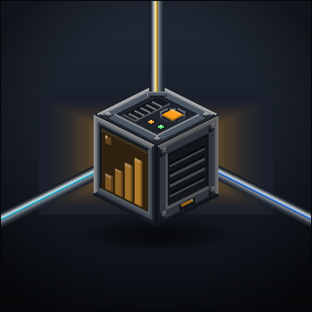
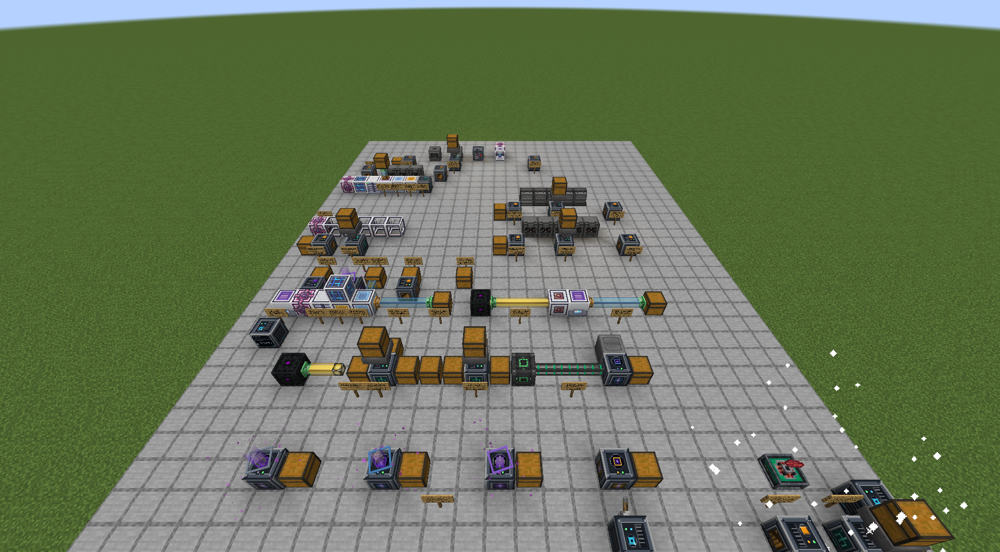

<!-- markdownlint-disable MD033 -->


# OmniLogistics

**One card system for every machine in your pack.** Minecraft 1.21.1 / NeoForge 21.1+, MIT.

Bind a Logistics Card to any block by sneak-clicking it, drop the card into a pipe, a Wireless Router or a Batch
Distributor, and the mod finds the working face of that machine by itself - on any mod's block, with no side
configuration anywhere. Items, FE and fluids, filtered by item / tag / enchantment / any data component, at a tick rate
you type in yourself, across dimensions if you want.

Cross-mod support is capability-only: there is no AE2, Mekanism or Actually Additions code in the build, and machines
nobody has written yet already work.

* **Project page text:** [English](docs/curseforge-en.md) · [Türkçe](docs/curseforge-tr.md)
* **How it is built, and why:** [ARCHITECTURE.md](ARCHITECTURE.md)
* **Screenshots:** [docs/press](docs/press)



## Building

No system JDK is needed; Gradle provisions its own.

```bash
export JAVA_HOME=~/.gradle/jdks/eclipse_adoptium-21-amd64-windows.2   # Git Bash on Windows
./gradlew build            # jar -> build/libs/omnilogistics-<version>.jar, plus unit tests
```

## Tasks

| Task | What it does |
| --- | --- |
| `runClient` | Opens the `OmniTest` world straight away, building the showcase if it is missing |
| `runClientPrepare` | Rebuilds `run/saves/OmniTest`, runs the showcase for 700 ticks, writes `run/selftest.txt`, quits |
| `runClientPress` | The same, then tours the finished world and writes `run/screenshots/omni_press_*.png` |
| `runClientSelfTest` | Opens every GUI in a flat world and screenshots it |
| `runGameTestServer` | 38 in-world GameTests |
| `test` | Unit tests |

Every build is checked three ways: the GameTests, the 26 in-world checks `runClientPrepare` writes to `selftest.txt`
(they run against whatever other mods are installed in `run/mods`), and the unit tests.

## Generated assets

Textures, models, recipes, loot tables, advancements, the Patchouli guide, the logo and the project page are all
produced by scripts - edit the script, not the output.

```bash
python tools/gen_textures.py     # every PNG the mod uses
python tools/gen_resources.py    # models, recipes, loot, advancements, guide
python tools/gen_logo.py         # src/main/resources/logo.png
python tools/gen_press.py        # docs/curseforge-*.md, item tables straight from the lang files
```

## Layout

```
src/main/java/com/mertokan/omnilogistics/
  api/          FilterSpec and the component predicate engine: the filter, on its own
  core/         shared GUI parts - dark screen, filter screen, interval box, payloads
  pipe/         item / energy / fluid conduits and their renderer
  router/       Logistics Cards, the Wireless Router, the card upgrade, the locator
  distributor/  the Batch Distributor: SPLIT and CLUSTER lanes
  extractor/    the Component Extractor and its modules
  miner/        Void Miners
  monitor/      the Machine Monitor
  compat/       JEI and Jade, both optional
  debug/        the showcase world and the self-test - never touched in a normal game
```
