# OmniLogistics

> **CurseForge summary field (255 max):** Bind a card to any block, drop it in a pipe or a router, and OmniLogistics
> finds that machine's working face itself - on any mod's block, with no side configuration. Items, FE and fluids,
> filtered by any data component, at a tick rate you type in.

**One card system for every machine in your pack.**

Bind a Logistics Card to any block by sneak-clicking it, drop the card into a pipe, a Wireless Router or a Batch
Distributor, and OmniLogistics works out the rest. It finds the working face of that machine by itself - the input side,
the output side, the power side - on any mod's block, with no side configuration anywhere. Filter by item, by tag, by
enchantment or by any data component. Type the tick rate you want, from 1 to 200. Move items, FE and fluids, across
dimensions if you like.

Nothing in this mod is hard-coded to another mod. It talks to NeoForge capabilities only, which means it already works
with machines nobody has written yet.

## The one idea

A **Logistics Card** is a pointer to a place and a filter for what may pass.

* **Sneak + right-click** any block to bind the card to it.
* **Right-click in the air** to open the filter: reference items, tags, enchantments, damage, custom data components,
  whitelist or blacklist.
* Put it in a **conduit** and that end of the run extracts or inserts. Put it in a **Wireless Router** and the router
  reaches the block with no conduit at all. Put eight in and it serves eight places in turn.
* The card remembers **what** it is bound to, not just where: the tooltip names the block, and one key press makes that
  block flash red through the wall it is buried in.

## Auto input, auto output

Most logistics mods ask you to configure the machine: mark this face as input, that face as output, and remember it. This
mod does not ask. When a card needs to put something into a machine it probes the faces of that machine through the
capability the machine already publishes, and uses the first one that accepts the item. Same for pulling out, same for
power, same for fluids. Blocks that expose no face at all - a plain chest - are handled too.

It will not, however, reach behind a face a machine deliberately declared: an assembler's pattern slot and a crafting
output are not ours to fill.

## Tiers that say what they are

Every tier is the previous one plus a core, and the name is the core: **Gilded** (gold), **Crystal** (diamond),
**Netherforged** (netherite). The card upgrade can also be done by hand - card in one hand, the core in the other, hold
right-click and rub them together - which teaches the recipe and unlocks the crafting version for automation.

## Works with

Tested end to end, in one world, every time the mod is built: **Applied Energistics 2** (ME networks, Pattern Provider
automation, Molecular Assemblers, Interfaces, Chargers), **Mekanism** (Enrichment Chambers, Metallurgic Infusers,
Crushers, Sawmills, their cables and cubes), **Actually Additions** (Empowerer, display stands, Crusher), **Powah**,
and vanilla. Any mod that exposes the NeoForge item, energy or fluid capability works without a line of code written
for it.

**JEI** and **Patchouli** are supported when present, and neither is required.

## Getting started

1. Craft an **Item Pipe** and a **Logistics Card**.
2. Sneak + right-click a chest with the card. The tooltip now says what it is bound to.
3. Drop the card into the pipe end next to that chest: that end now pulls from it.
4. Run the pipe to a machine. Nothing to configure on the machine.
5. When one pipe is not enough, put the card in a **Wireless Router** instead and forget about the pipe.

## Requirements

Minecraft **1.21.1** (NeoForge 21.1+) or **26.1.2** (NeoForge 26.1.2+). Client and server. MIT licensed.

On 26.1.2 the in-world tests run against AE2 and Powah; Mekanism and Actually Additions have no 26.1.2 build yet, and the mod does not need either of them.

## Everything in the mod

### Conduits

| Item | What it does |
| --- | --- |
| **Item Pipe** | Moves items. Faces: NORM (connected), EXTRACT (takes out of that block, green), INSERT (only puts into it, orange), OFF. |
| **Gilded Item Pipe** | Moves items. Faces: NORM (connected), EXTRACT (takes out of that block, green), INSERT (only puts into it, orange), OFF. |
| **Crystal Item Pipe** | Moves items. Faces: NORM (connected), EXTRACT (takes out of that block, green), INSERT (only puts into it, orange), OFF. |
| **Netherforged Item Pipe** | Moves items. Faces: NORM (connected), EXTRACT (takes out of that block, green), INSERT (only puts into it, orange), OFF. |
| **Omni Item Pipe** | Creative only. Moves 65536 items every tick. |
| **Energy Cable** | Moves FE. Set IN on the generator side; everything else connected receives. |
| **Gilded Energy Cable** | Moves FE. Set IN on the generator side; everything else connected receives. |
| **Crystal Energy Cable** | Moves FE. Set IN on the generator side; everything else connected receives. |
| **Netherforged Energy Cable** | Moves FE. Set IN on the generator side; everything else connected receives. |
| **Omni Energy Cable** | Creative only. 16M FE per tick. |
| **Fluid Pipe** | Moves fluids. Set IN on the tank side; everything else connected receives. |
| **Gilded Fluid Pipe** | Moves fluids. Set IN on the tank side; everything else connected receives. |
| **Crystal Fluid Pipe** | Moves fluids. Set IN on the tank side; everything else connected receives. |
| **Netherforged Fluid Pipe** | Moves fluids. Set IN on the tank side; everything else connected receives. |
| **Omni Fluid Pipe** | Creative only. 8M mB per tick. |

### Machines

| Item | What it does |
| --- | --- |
| **Wireless Router** | Holds 8 cards + 2 upgrades. Moves items and FE to and from bound blocks without cables. |
| **Batch Distributor** | Six lanes, one Logistics Card each: an AE2 Pattern Provider pushes one whole pattern in and every ingredient goes to its own machine. |
| **Component Extractor** | Base: moves enchantments onto books. Modules add gem extraction and fusion. |
| **Inventory Exposer** | Shows a filtered view of the inventory on its target face. |
| **Machine Monitor** | A screen for any machine, from any mod: energy, fluid and the first item stacks. |
| **Void Miner** | Mines ore out of nothing: FE in, ore out. Logistics Card = filter, Bandwidth Upgrades x3 (x2 items and FE per cycle each), redstone pauses. |
| **Gilded Void Miner** | Mines ore out of nothing: FE in, ore out. Logistics Card = filter, Bandwidth Upgrades x3 (x2 items and FE per cycle each), redstone pauses. |
| **Crystal Void Miner** | Mines ore out of nothing: FE in, ore out. Logistics Card = filter, Bandwidth Upgrades x3 (x2 items and FE per cycle each), redstone pauses. |
| **Netherforged Void Miner** | Mines ore out of nothing: FE in, ore out. Logistics Card = filter, Bandwidth Upgrades x3 (x2 items and FE per cycle each), redstone pauses. |

### Cards

| Item | What it does |
| --- | --- |
| **Logistics Card** | Sneak + right-click a block to bind. Right-click in air to configure. |
| **Gilded Logistics Card** | A Logistics Card that whitelists 4 different items instead of 1. Works everywhere a Logistics Card does. |
| **Crystal Logistics Card** | A Logistics Card that whitelists 16 different items instead of 1. |
| **Netherforged Logistics Card** | A Logistics Card that whitelists 64 different items instead of 1. |
| **Energy Card** | Wireless FE. Sneak + right-click a machine to bind, right-click in air to flip mode. |
| **Fluid Card** | EXTRACT / INSERT fluid against the bound tank. |
| **Stock Keeper Card** | Keeps the bound inventory topped up to one stack of what the router is carrying. |
| **Vacuum Card** | Pulls matching dropped items around the router (or the bound block) into the buffer. |
| **Void Card** | Destroys matching items that reach the router buffer. |
| **Detector Card** | Router emits redstone 15 while the bound inventory holds a matching item. |
| **Activator Card** | Right-clicks the bound block face with the buffer item, like a player. |
| **Breaker Card** | Breaks the bound block; drops go into the router buffer. |
| **Placer Card** | Places the buffer item as a block at the bound position. |

### Upgrades and modules

| Item | What it does |
| --- | --- |
| **Bandwidth Upgrade** | Router: x2 card actions per cycle per copy (max 3). |
| **Antenna Upgrade** | Router: +64 blocks range per copy (max 3). |
| **Lane Upgrade** | Extractor: unlocks one more lane per copy (max 2), items process in parallel. |
| **Chunk Loader Upgrade** | Router: keeps its own chunk and the chunks of its bound cards ticking while you are away (up to 9, config). |
| **Component Module** | Extractor: also pulls items embedded in modded components out of gear. |
| **Fusion Module** | Extractor: unlocks FUSE mode. |
| **Logistics Wrench** | Pipe arm: cycle NORM / EXTRACT / INSERT / OFF. Pipe centre: redstone mode. Exposer face: set target. |

## Screenshots

*The whole test site: every block of the mod plus four other mods, all fed by cards.*

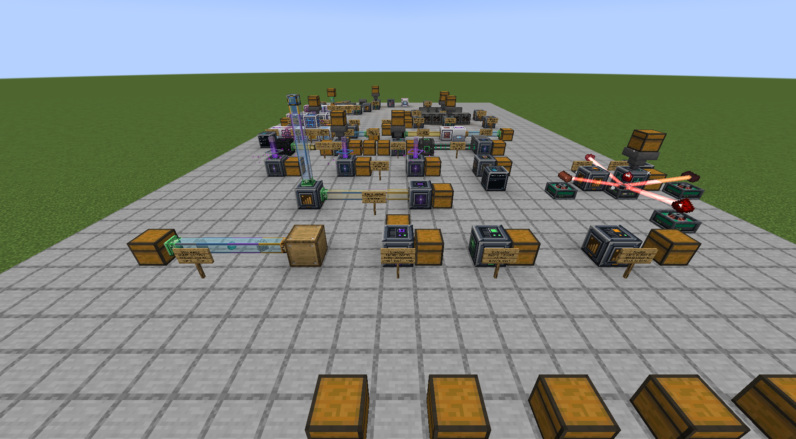
*Conduits, the Inventory Exposer, the Component Extractor and a Wireless Router.*

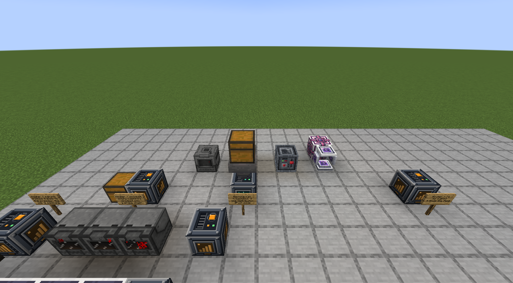
*One Batch Distributor feeding four machines from three different mods.*

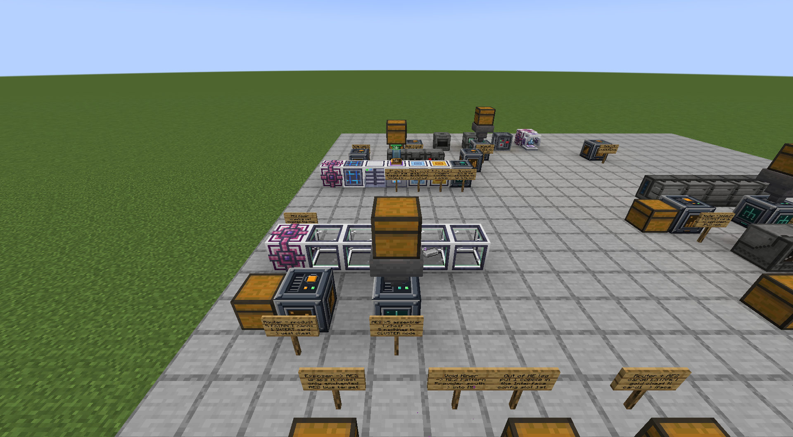
*CLUSTER mode: one chest, five AE2 Molecular Assemblers, each taking a whole batch.*

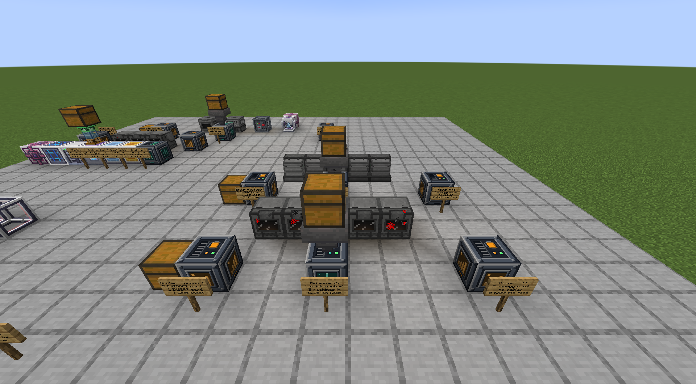
*The same shape again with five Mekanism Enrichment Chambers - and no side configuration.*

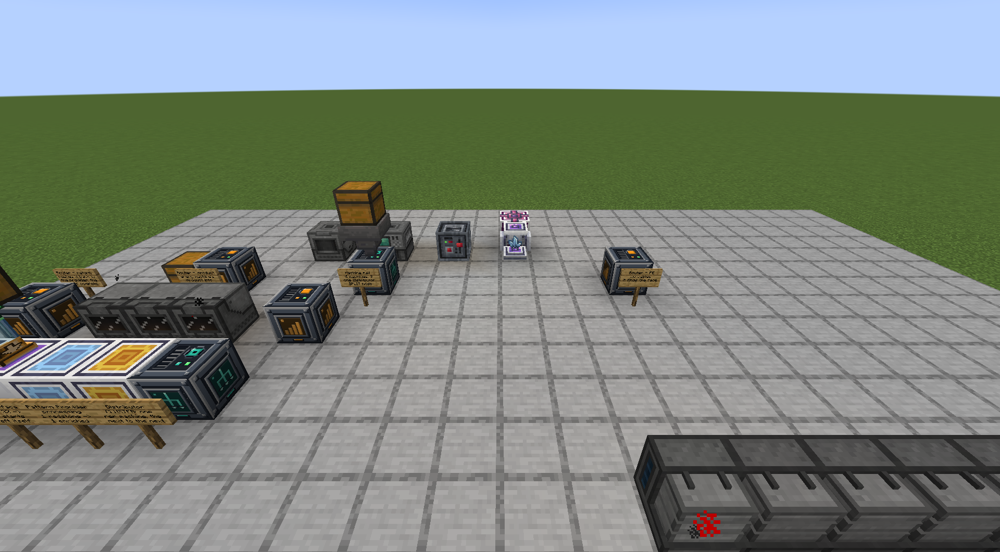
*An AE2 Pattern Provider loop that crafts on its own: nobody clicks anything.*

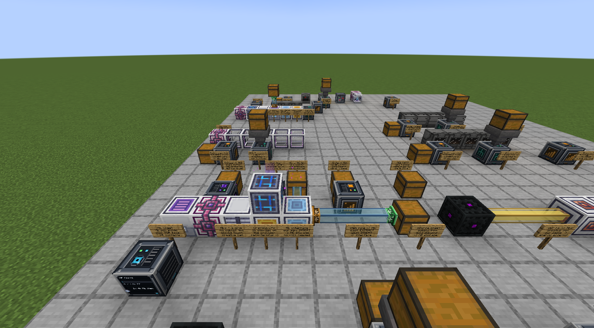
*A real ME network: our pipes put items in and take them out, no AE2 parts needed.*

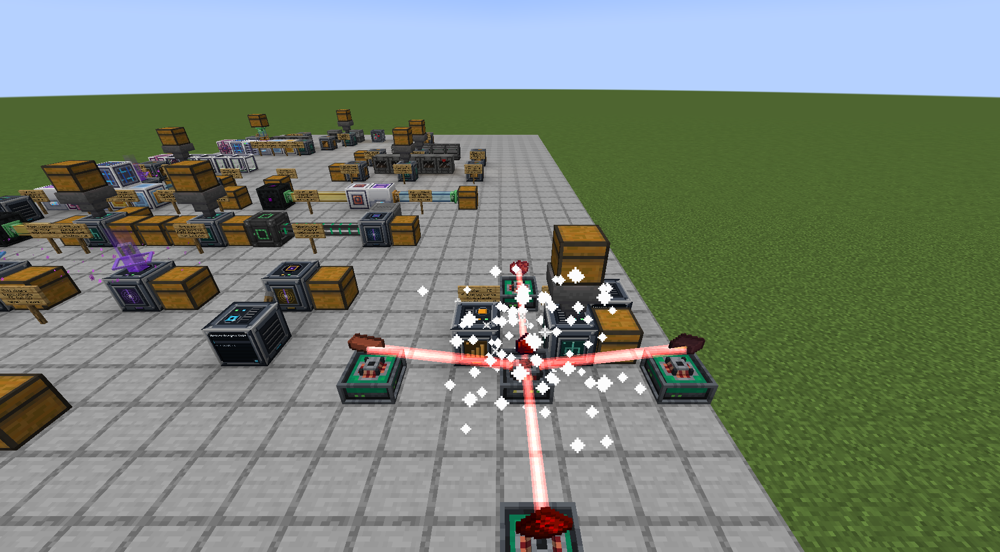
*Actually Additions: four display stands fed and powered by four cards, no cables.*

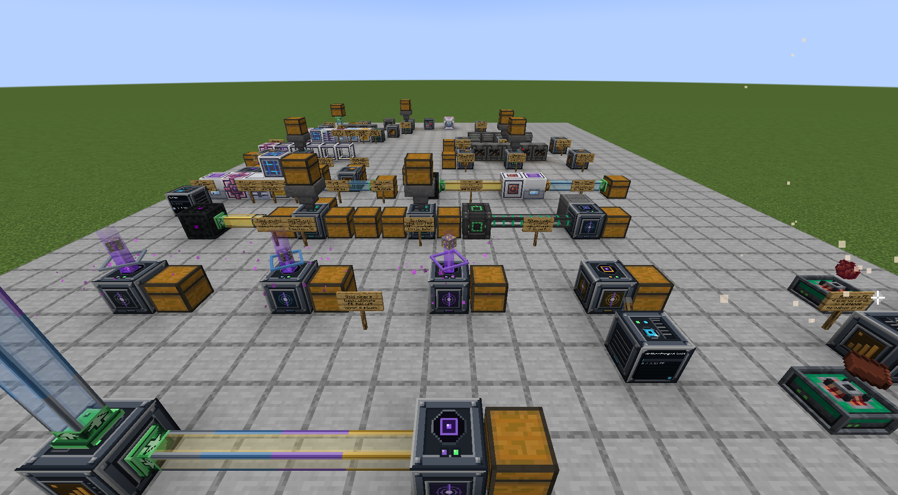
*Void Miners, one per tier, each with a card as its ore filter.*

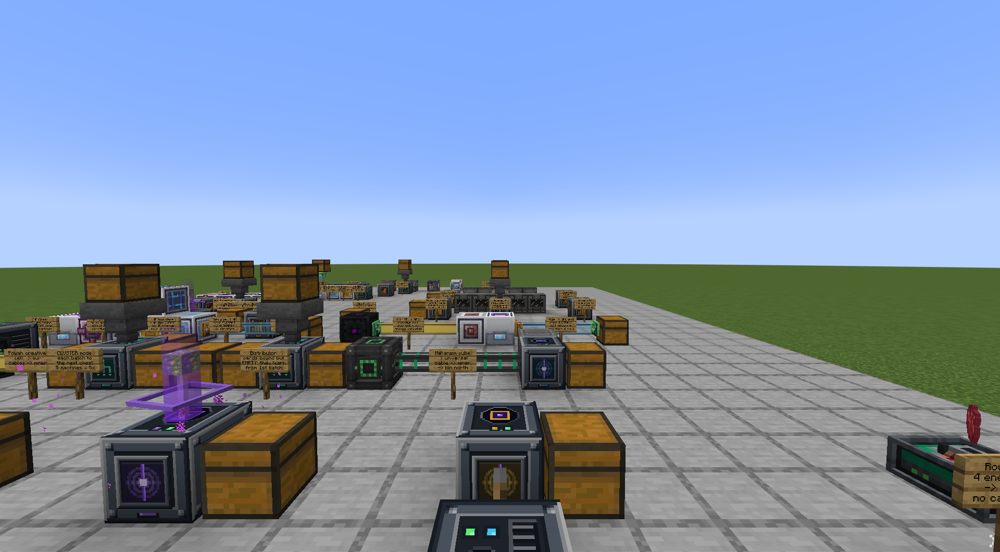
*The Machine Monitor: point a card at a machine and read it from across the room.*

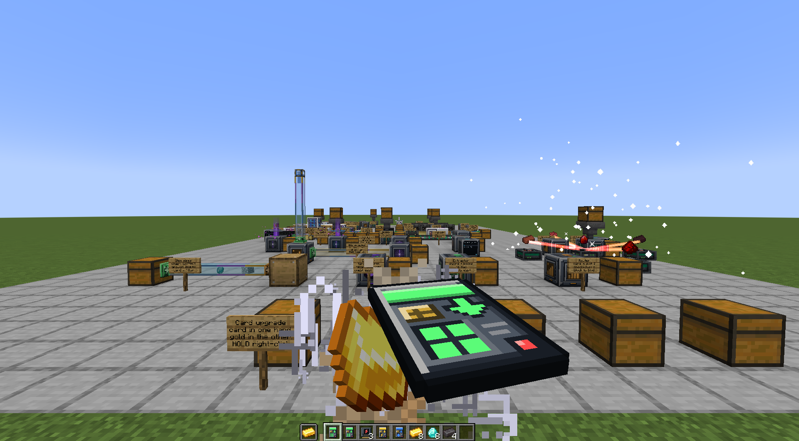
*The card upgrade ritual: card in one hand, gold in the other, hold right-click.*

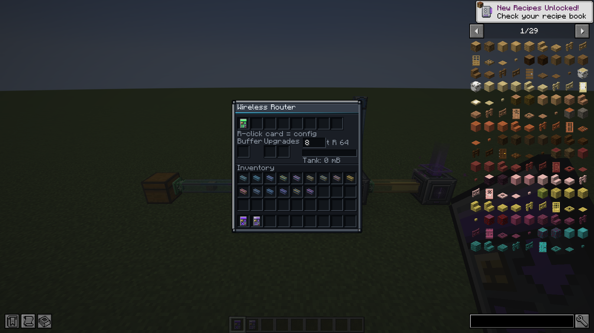
*The Wireless Router: eight card slots, two upgrade slots and a tick field you can type into.*

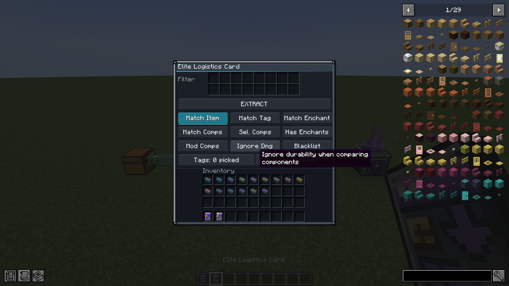
*The card filter: 16 reference items, tags, enchantments, any data component.*

